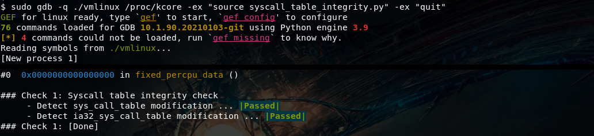
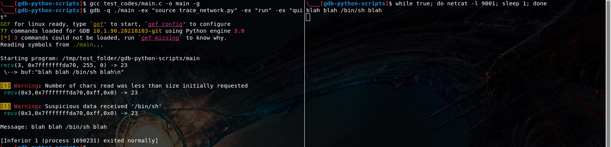

# gdb-python-scripts

This repo will contain gdb python scripts from scratch. The aim of the repo is to practice with the gdb python API.

## Contents ##

 - [syscall_table_integrity.py](syscall_table_integrity.py)
    * description: inspect syscall table and check its integrity
    * usage: `sudo gdb -q ./vmlinux /proc/kcore -ex "source syscall_table_integrity.py" -ex "quit"`

 

 - [trace_network.py](trace_network.py)
    * description: trace network syscall and get alerts from suspicious packets flow (create your own alert rules)
    * usage: `gdb -q ./main -ex "source trace_network.py" -ex "run" -ex "quit"`

